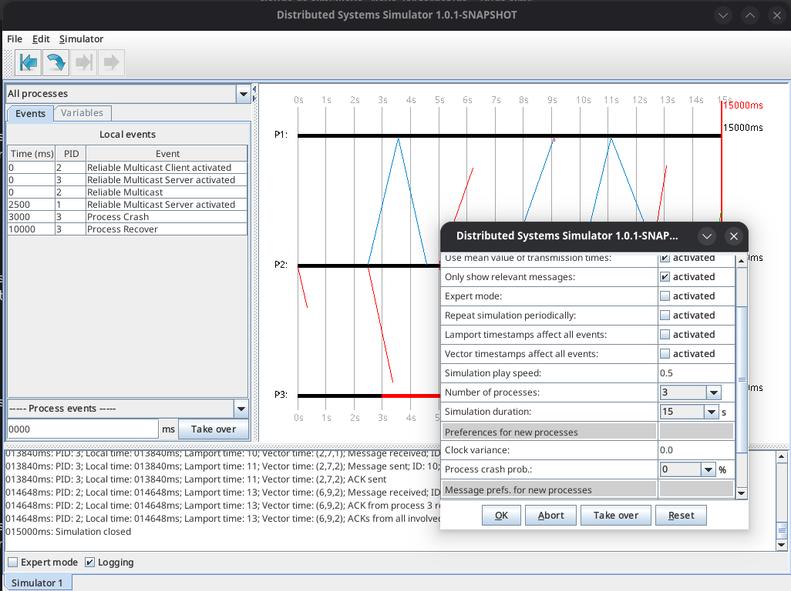

# DS-Sim

DS-Sim is a open-source simulator for distributed systems, written in Java. It provides a powerful environment for simulating and learning about distributed systems concepts.

Have also a read at this 3-part blog series about DS-Sim: https://foo.zone/gemfeed/2026-03-31-distributed-systems-simulator-part-1.html



## Features

- Protocol simulation
- Event handling
- Lamport and Vector time implementations
- Modern Java-based architecture
- Interactive GUI using Swing
- Comprehensive logging


## Requirements

- Java 21 or higher
- Maven 3.8 or higher

## Quick Start

```bash
# Clone the repository
git clone https://github.com/yourusername/ds-sim.git
cd ds-sim

# Set JAVA_HOME if needed (Fedora Linux)
export JAVA_HOME=/usr/lib/jvm/java-21-openjdk

# Build and run in one step
mvn clean package && java -jar target/ds-sim-*.jar
```

## Building the Project

### Full Build
```bash
# Clean and build everything (recommended)
mvn clean package
```

### Development Build
```bash
# Fast compilation only
mvn compile

# Build without running tests (faster)
mvn package -DskipTests
```

## Testing

The project includes comprehensive unit tests and a testing framework for protocol simulations.

### Running Unit Tests
```bash
# Run all unit tests (CI-compatible)
mvn test

# Run specific test class
mvn test -Dtest=VSMessageTest

# Run tests matching a pattern
mvn test -Dtest="*Protocol*"

# Build without tests
mvn clean package -DskipTests
```

### Test Coverage

- **Core components**: VSTask, VSMessage, process management
- **Event system**: Event handling and registration
- **Protocol implementations**: PingPong, Two-Phase Commit, Berkeley Time, etc.
- **Total**: 141 unit tests (headless-compatible)

### Protocol Simulation Testing

DS-Sim includes a framework for testing protocol simulations:
```bash
# Interactive test runner (Note: produces GUI errors in headless mode)
./scripts/test-protocols.sh
```

For detailed testing information, see [docs/testing-guide.md](docs/testing-guide.md).

### View Test Results

```bash
# Test reports are generated in:
target/surefire-reports/

# View summary of last test run
cat target/surefire-reports/*.txt
```

### Build Output

After building, you'll find:

- `target/ds-sim-1.1.0.jar` - Executable JAR with all dependencies
- `target/classes/` - Compiled class files
- `target/original-ds-sim-1.1.0.jar` - JAR without dependencies

## Running the Application

### Method 1: Using JAR File (Recommended)

```bash
# After building, run the executable JAR
java -jar target/ds-sim-*.jar
```

## Cleaning the Project

### Remove All Build Artifacts
```bash
# Clean everything Maven generated
mvn clean
```

### Force Clean (if needed)
```bash
# Remove target directory manually if Maven clean fails
rm -rf target/
mvn clean
```

## Development Workflow

```bash
# 1. Make code changes
# 2. Quick compile to check for errors
mvn compile

# 3. Run tests
mvn test

# 4. Build and test the application
mvn package && java -jar target/ds-sim-1.1.0.jar

# 5. Clean up when done
mvn clean
```

## Maven Command Reference

| Command | Purpose | When to Use |
|---------|---------|-------------|
| `mvn compile` | Compile source code only | Quick syntax checking |
| `mvn test` | Run unit tests | Before committing code |
| `mvn package` | Create JAR files | Ready to distribute |
| `mvn clean package` | Full clean build | First build or after major changes |
| `mvn exec:java` | Run application directly | Quick testing without JAR |
| `mvn javadoc:javadoc` | Generate documentation | Creating API docs |
| `mvn clean` | Remove build artifacts | Clean workspace |
| `mvn package -DskipTests` | Fast build without tests | Development iterations |

## Project Structure

```
ds-sim/
├── src/
│   └── main/
│       ├── java/           # Source code
│       │   ├── core/       # Process and message handling
│       │   ├── events/     # Event system
│       │   ├── protocols/  # Distributed algorithms
│       │   ├── simulator/  # Main simulation engine  
│       │   └── utils/      # Utilities and helpers
│       └── resources/      # Configuration files
├── docs/                   # Documentation
│   ├── index.md           # Documentation index
│   ├── architecture.md    # System architecture and design
│   ├── developer-guide.md # Guide for extending DS-Sim
│   └── testing-guide.md   # Comprehensive testing guide
├── saved-simulations/      # Example simulation files
├── scripts/               # Development scripts
└── pom.xml               # Maven configuration
```

## Documentation

📚 **[Full Documentation Index](docs/index.md)** - Complete list of all documentation

### Key Documents:

- **[Architecture Guide](docs/architecture.md)** - System design, components, and diagrams
- **[Developer Guide](docs/developer-guide.md)** - How to create new protocols and events
- **[Testing Guide](docs/testing-guide.md)** - Comprehensive testing documentation
- **[Timestamp Events Guide](docs/timestamp-events-guide.md)** - Using timestamp-triggered events

## Contributing

1. Fork the repository
2. Create your feature branch (`git checkout -b feature/amazing-feature`)
3. Commit your changes (`git commit -m 'Add some amazing feature'`)
4. Push to the branch (`git push origin feature/amazing-feature`)
5. Open a Pull Request

## License

This project is licensed under the terms of the license included in the repository.

## Acknowledgments

- Original VS-Sim project: https://codeberg.org/snonux/vs-sim/
