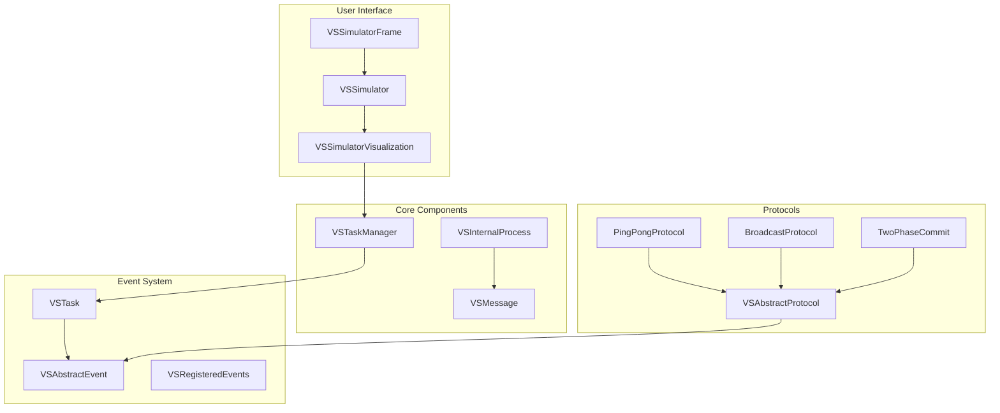
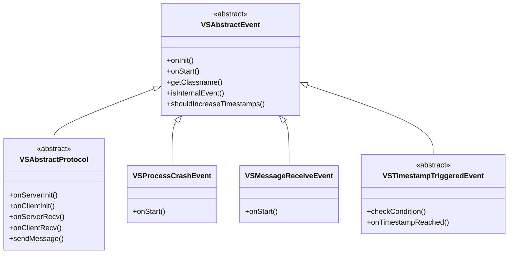
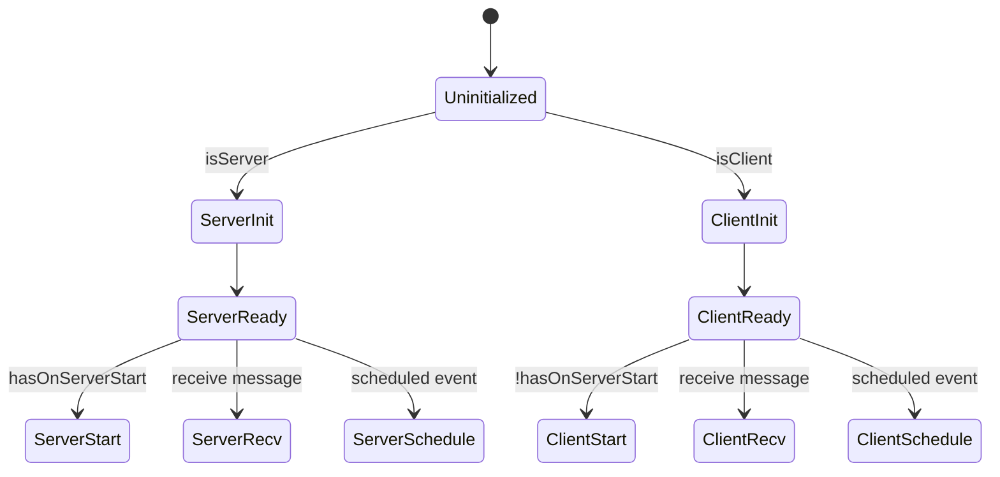
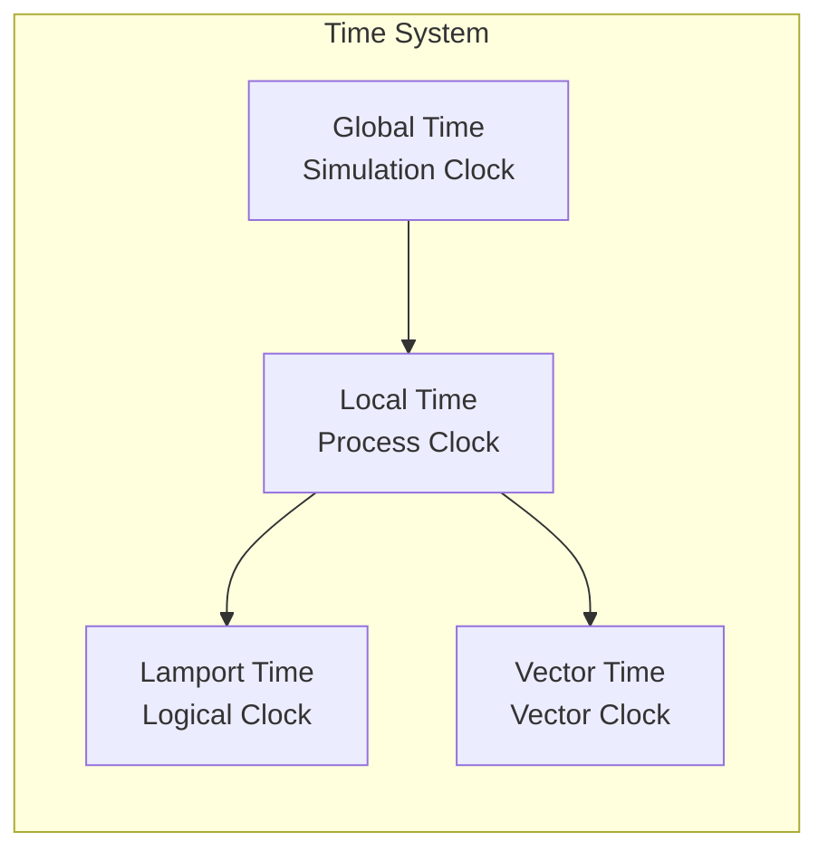
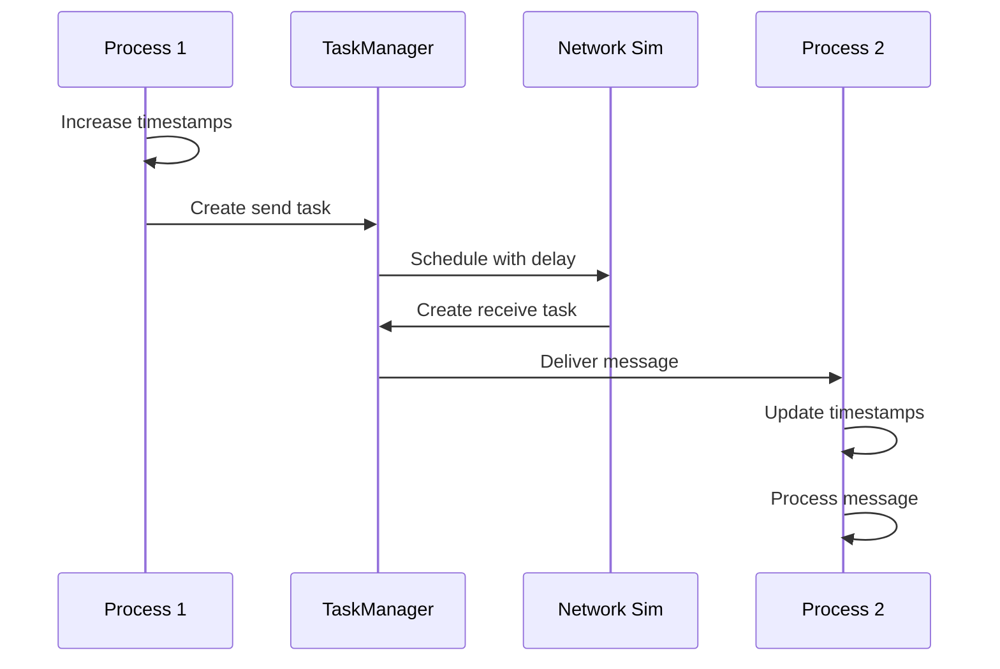
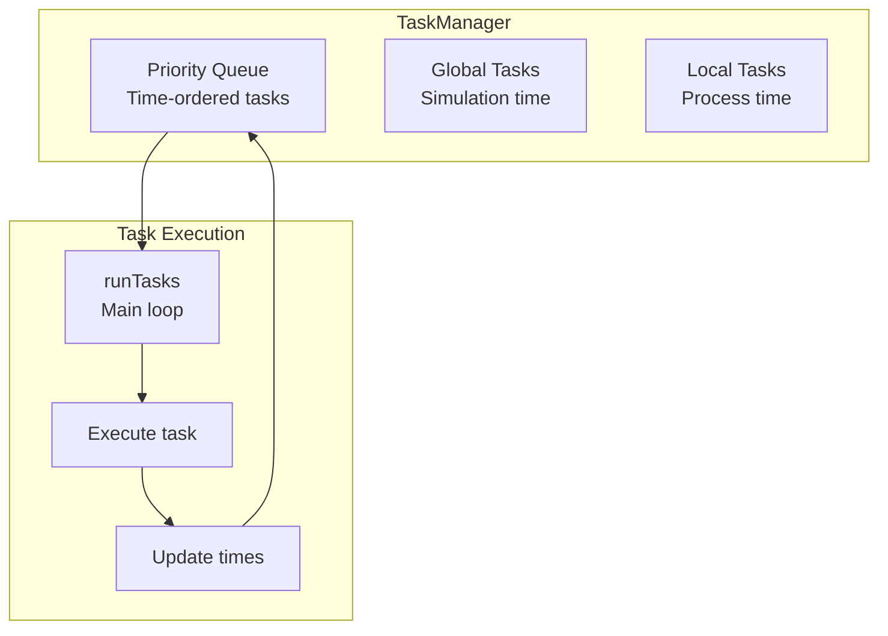
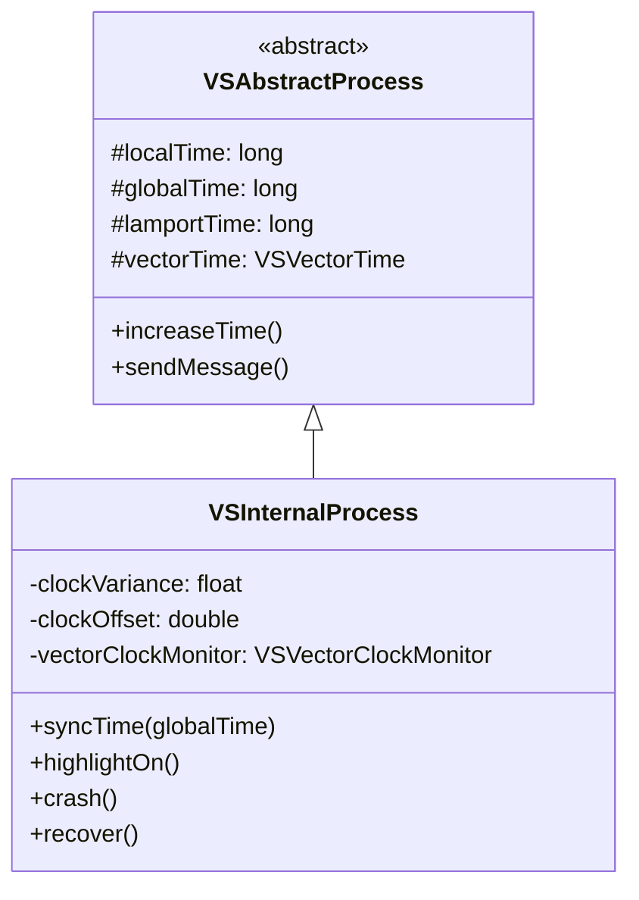
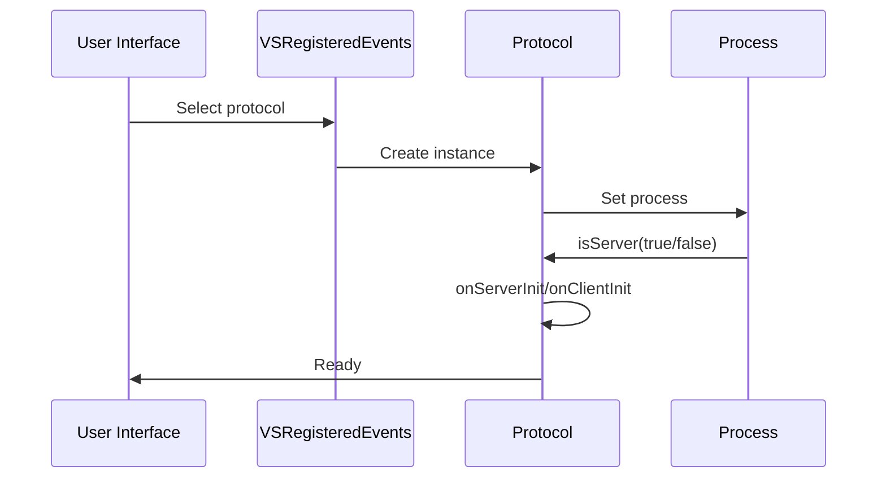
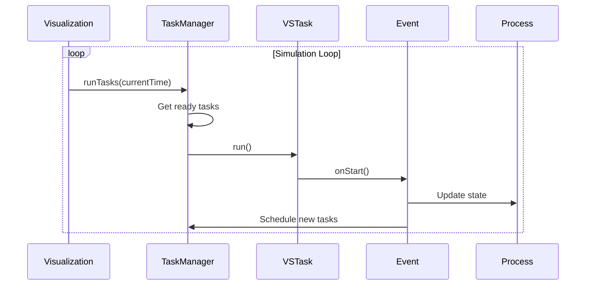
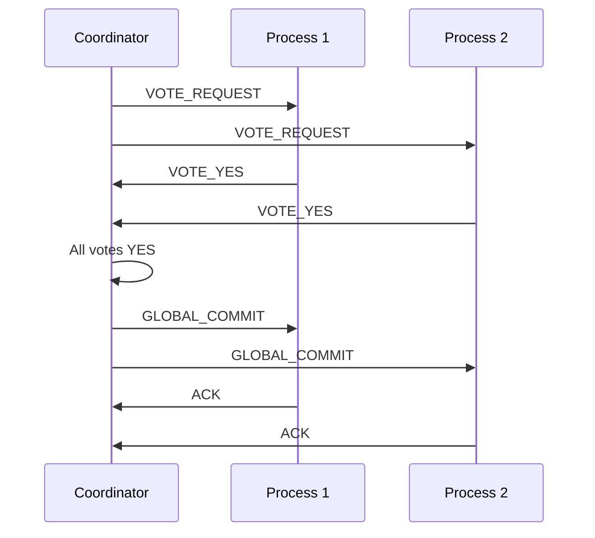

# DS-Sim Architecture Documentation

## Table of Contents
1. [Overview](#overview)
2. [Core Architecture](#core-architecture)
3. [Event-Driven Design](#event-driven-design)
4. [Protocol Framework](#protocol-framework)
5. [Time Management](#time-management)
6. [Message System](#message-system)
7. [Component Diagrams](#component-diagrams)
8. [Sequence Diagrams](#sequence-diagrams)

## Overview

DS-Sim is an event-driven distributed systems simulator built with Java. It provides a visual environment for simulating and understanding distributed algorithms, protocols, and time synchronization mechanisms.

### Key Design Principles
- **Event-Driven Architecture**: All actions are modeled as events
- **Pluggable Protocols**: Easy to add new distributed algorithms
- **Visual Feedback**: Real-time visualization of process states and messages
- **Time Simulation**: Support for logical clocks and clock drift

## Core Architecture

### Layer Diagram
```
┌─────────────────────────────────────────────────────────────┐
│                    User Interface Layer                      │
│  VSSimulatorFrame, VSSimulator, VSSimulatorVisualization   │
├─────────────────────────────────────────────────────────────┤
│                    Protocol Layer                            │
│  VSAbstractProtocol, Protocol Implementations               │
├─────────────────────────────────────────────────────────────┤
│                    Event System Layer                        │
│  VSAbstractEvent, VSTask, VSTaskManager                     │
├─────────────────────────────────────────────────────────────┤
│                    Core Process Layer                        │
│  VSAbstractProcess, VSInternalProcess, VSMessage            │
├─────────────────────────────────────────────────────────────┤
│                    Infrastructure Layer                      │
│  Time Management, Serialization, Utilities                  │
└─────────────────────────────────────────────────────────────┘
```

### Component Overview



## Event-Driven Design

The simulator operates on an event-driven model where all actions are encapsulated as events that are scheduled and executed by the task manager.

### Event Hierarchy



### Event Lifecycle

1. **Creation**: Events are created with specific parameters
2. **Initialization**: `onInit()` is called once when first added
3. **Scheduling**: Events are wrapped in `VSTask` with execution time
4. **Execution**: `onStart()` is called when scheduled time arrives
5. **Completion**: Event completes or schedules new events

## Protocol Framework

Protocols implement distributed algorithms and define client-server communication patterns.

### Protocol Structure



### Protocol Implementation Pattern

```java
public class MyProtocol extends VSAbstractProtocol {
    public MyProtocol() {
        super(HAS_ON_SERVER_START); // or HAS_ON_CLIENT_START
    }
    
    // Server-side methods
    public void onServerInit() { /* Initialize server state */ }
    public void onServerStart() { /* Server begins protocol */ }
    public void onServerRecv(VSMessage msg) { /* Handle client message */ }
    public void onServerSchedule() { /* Periodic server action */ }
    
    // Client-side methods  
    public void onClientInit() { /* Initialize client state */ }
    public void onClientStart() { /* Client begins protocol */ }
    public void onClientRecv(VSMessage msg) { /* Handle server message */ }
    public void onClientSchedule() { /* Periodic client action */ }
}
```

## Time Management

The simulator supports multiple time representations for distributed systems research.

### Time Types



### Clock Synchronization

- **Global Time**: Absolute simulation time (milliseconds)
- **Local Time**: Process time with configurable drift
- **Lamport Time**: Increments on events and messages
- **Vector Time**: Array of logical times for each process

### Clock Drift Simulation

```
Local Time = Global Time + Accumulated Drift
Drift Rate = Clock Variance (e.g., -0.1 to +0.1)
```

## Message System

Messages in DS-Sim carry protocol data between processes with automatic timestamp management.

### Message Flow



### Message Properties

- **Sender/Receiver**: Process IDs
- **Protocol**: Associated protocol class
- **Timestamps**: Lamport and vector times
- **Payload**: Serializable data
- **Type**: Server or client message

## Component Diagrams

### Task Management System



### Process Architecture



## Sequence Diagrams

### Protocol Initialization



### Event Processing Loop



### Two-Phase Commit Example



## Adding New Components

### Creating a New Event

1. Extend `VSAbstractEvent`
2. Implement `onInit()` and `onStart()`
3. Register in `VSRegisteredEvents.init()`

### Creating a New Protocol

1. Extend `VSAbstractProtocol`
2. Implement required abstract methods
3. Choose `HAS_ON_SERVER_START` or `HAS_ON_CLIENT_START`
4. Register in `VSRegisteredEvents.init()`

### Creating Timestamp-Triggered Events

1. Extend `VSTimestampTriggeredEvent`
2. Implement `onTimestampReached()`
3. Configure trigger conditions
4. Register with process monitor

## Design Patterns Used

- **Template Method**: Protocol base class defines structure
- **Observer**: Event system for loose coupling
- **Strategy**: Pluggable protocols and events
- **Factory**: Event creation through registry
- **Singleton**: Global registries and managers
- **Command**: Events encapsulate actions

## Future Architecture Improvements

1. **GUI Separation**: Extract UI from business logic
2. **Dependency Injection**: Remove static registries
3. **Event Bus**: Decouple component communication
4. **Plugin System**: Dynamic protocol loading
5. **Reactive Streams**: Modern async event handling